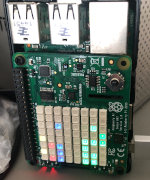

# Binary Sense

Simple project to display a binary clock (hour, minute, second) in the first 3 columns of
a Sense HAT, and (pressure, humidity, temperature) in the last 3 columns.

Middle columns reserved for future use e.g. a very inaccurate earthquake sensor.

All data is represented in binary form, and has some thresholds to define what color to display. Barometric pressure is an exception because values don't fit in 8 bits, so the value is relative to 1000, where red are values below 1000. Yeah, I could probably do that better, and I'll learn a better way :)

# How to use

    python3 ./main.py 180

Where 180 is the rotation I like (USB/Ethernet ports pointing upwards, so the data will display as columns)

# Tests

Use pytest:

    $ pytest

    ============================================== test session starts ==============================================

    platform linux -- Python 3.7.3, pytest-3.10.1, py-1.7.0, pluggy-0.8.0
    rootdir: /home/pi/binarysense, inifile:
    collected 6 items

    test_binary.py ......                                                                                     [100%]

    =========================================== 6 passed in 0.19 seconds ============================================

